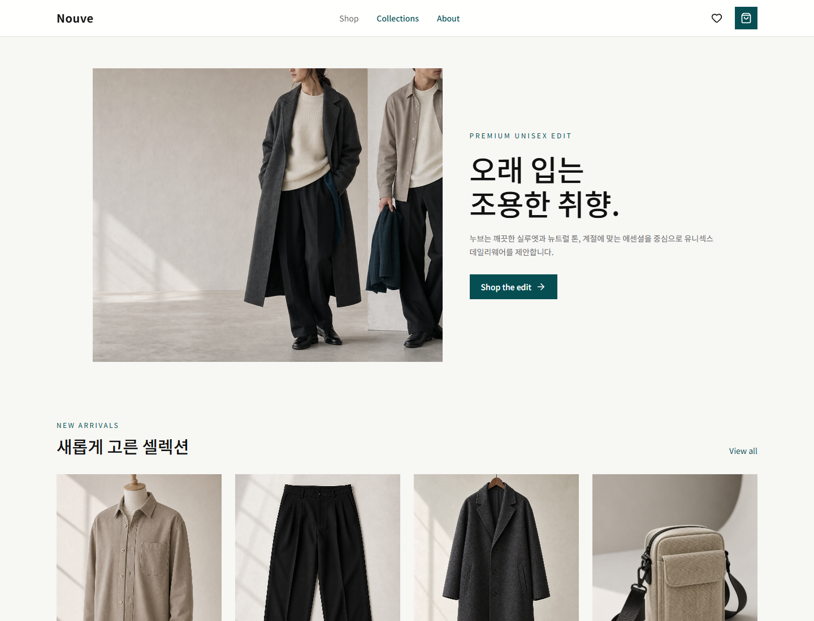
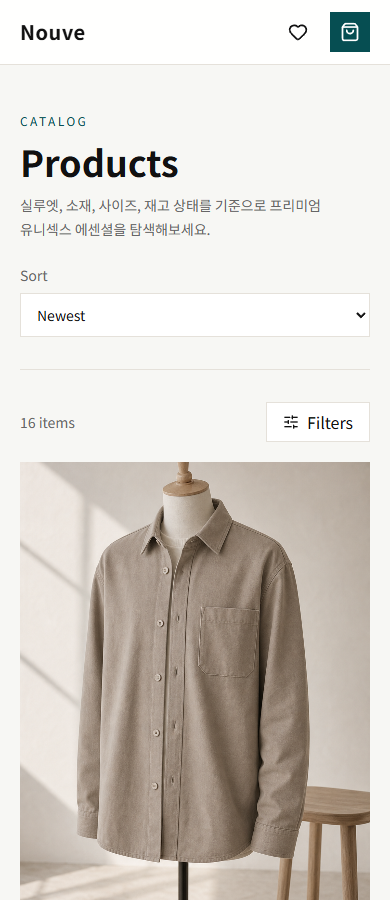
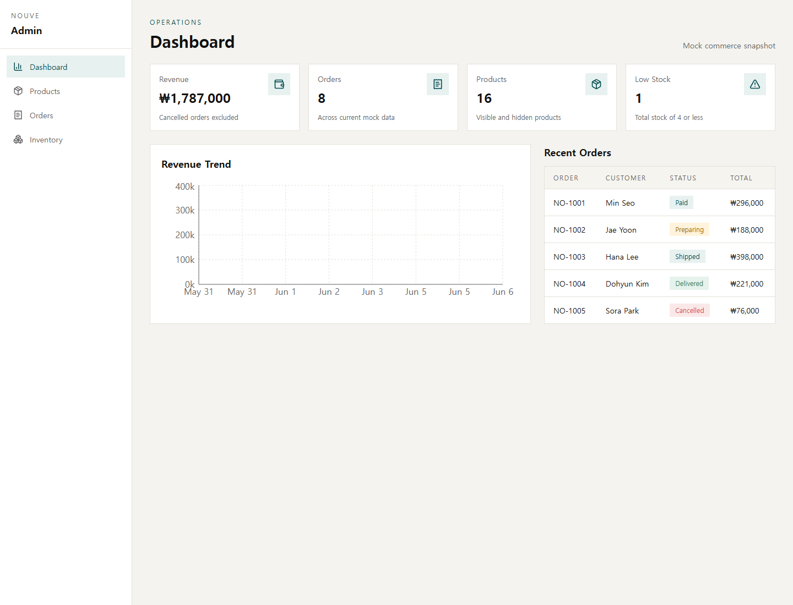

# Nouve

프리미엄 유니섹스 미니멀웨어를 주제로 만든 프론트엔드 전용 커머스 포트폴리오 프로젝트입니다. 백엔드 없이 mock data와 client-side service를 API 경계처럼 구성해, 고객 쇼핑 흐름과 관리자 운영 화면을 함께 보여주는 데 집중했습니다.

## Screenshots





## Core Flows

- Customer: 홈, 상품 목록, URL 기반 필터/정렬, 상품 상세, 위시리스트, 장바구니, mock checkout, 주문 완료
- Admin: 대시보드 지표, 상품 검색/공개 상태 변경, 주문 상태 변경, 사이즈별 재고 확인
- State: TanStack Query로 mock API loading/cache 흐름을 만들고, Zustand로 cart/wishlist를 로컬 persist 처리
- Assets: `public/assets/nouve/`에 로컬 이미지 저장, `docs/assets/image-sources.md`에 사용 출처 기록

## Tech Stack

- React + TypeScript + Vite: 빠른 개발 환경과 타입 안정성
- React Router: customer/admin route 분리
- TanStack Query: mock service도 실제 API처럼 로딩/캐시/갱신 흐름 구성
- Zustand: cart/wishlist persistence
- React Hook Form + Zod: checkout validation
- Tailwind CSS: 디자인 토큰 기반 UI 구현
- Recharts: admin revenue trend visualization
- Vitest + Testing Library: 핵심 사용자 흐름 테스트

## UI/UX Direction

`#064E52` 딥 틸을 primary color로 사용하되, 고객 화면은 이미지와 여백 중심의 조용한 프리미엄 톤을 유지했습니다. 관리자 화면은 카드형 마케팅 UI보다 테이블, 필터, 상태 변경 컨트롤을 우선해 반복 업무에 맞는 밀도를 잡았습니다.

## Mock Architecture

```text
src/data              # products, orders, collections
src/services          # async mock commerce service
src/stores            # persisted cart/wishlist stores
src/features/products # discovery and detail
src/features/cart     # cart page
src/features/checkout # checkout and order complete
src/features/admin    # dashboard, products, orders, inventory
```

## Run Locally

```bash
npm install
npm run dev
npm test
npm run lint
npm run build
```

## Verification

Current automated coverage includes product filtering, service updates, routing, cart/wishlist stores, product detail, cart totals, checkout validation/submission, admin visibility/status updates, and local asset path integrity.

## Development Workflow

- Keep README content aligned with the current feature set, screenshots, run commands, and mock architecture.
- Commit work in functional atomic units, for example product discovery, cart/wishlist, checkout, admin, image assets, and documentation polish.
- Before pushing, run the project verification commands and push the completed feature branch after the atomic commits are in place.

## Future Improvements

- Product image set expansion so every mock product has a unique image
- Admin product edit drawer with field-level validation
- Mobile filter drawer for the product listing
- Storybook or component catalog for design-system review
